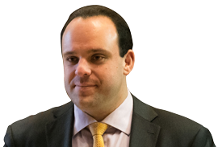
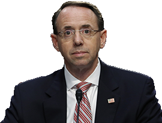

You hear about the investigation into President Trump and Russia every day. It is extremely complicated, and difficult to keep track of everything.

There is the criminal investigation being led Special Counsel Robert Mueller on behalf of the Justice Department and the FBI. It could potentially end in criminal charges for people in Trump's White House and inner circle. Then there are two House investigations -- one from its Intelligence Committee and one from its Oversight and Government Reform Committee. Finally, there are two Senate investigations -- one from its Intelligence Committee and one from its Judiciary Committee.

All of these investigations are centered on the same central topics: What role Russian hackers played in the 2016 campaign, and whether the Trump campaign colluded with the Russian government. Most of these investigations also have the same players overlapping, as well as some side characters whose ultimate significance may not yet be fully understood.

Here's a look at who's who at a glance, and how they're connected.
^^^^^^
## The Trump family

### Donald Trump
#### 45th U.S. President who won a surprise victory in 2016
Evidence is consistently surfacing that Trump or people in his orbit may have had some kind of interaction with the Russian government during the campaign, but Trump has denied having any political or business ties. According to the Senate Intelligence Committee testimony of former FBI Director James Comey, Trump asked Comey to back off of the criminal investigation into campaign adviser turned National Security Adviser Michael Flynn's ties to Russia. He also reportedly ordered Director of National Intelligence Dan Coats and NSA Chief Mike Rogers to publicly say there was no wrongdoing on Trump's behalf, and told them to get Comey to lay off of Flynn.

### Jared Kushner
#### Trump's son-in-law, who serves as one of his closest advisers
Kushner had denied having any interactions with Russian officials during the campaign, but subsequently acknowledged having two meetings. Reuters reported in May that Kushner spoke with Kremlin officials last year about setting up a secret backchannel to communicate about diplomatic matters. Around the same time, Kushner also met with the chief executive of a state-owned bank who has ties to Putin, and it is not clear why. Kushner has reportedly become a focus of the criminal investigation into the Trump campaign, but he faces no charges or specific allegations. He turned out to have yet another Russia interaction, in a secret meeting at Trump Tower (see Donald Trump Jr.).

### Eric Trump
#### Trump's son who co-runs the Trump Organization
Golf writer James Dodson claimed this year that Eric in 2014 told him that Russia gives the family <q>all the funds we need</q> for their golf courses. Eric has denied this encounter happened. He runs the Trump Organization with Donald Trump Jr.

### Donald Trump Jr.
#### Trump's eldest son and a trustee of the Trump Organization
President Trump's oldest son, who has admitted to setting up a meeting between campaign officials and a Kremlin-connected Russian lawyer to get dirt on Hillary Clinton in June 2016. After days of New York Times reports revealed the meeting, Trump tweeted the emails he exchanged with Rob Goldstone (see below), a music promoter who offered a chance for intel on Clinton. Goldstone made clear that this was part of Russia's bid to help Donald Trump, and Trump Jr. replied, "if it's what you say I love it." Trump Jr. claims he was only expecting to get basic opposition research. 
^^^^^^
## Trump associates

### Jeff Sessions
#### Former U.S. Senator and now Trump's Attorney General
Sessions recused himself from the criminal investigation after the Washington Post revealed in March that he spoke with Russian Ambassador Sergey Kislyak twice during the 2016 campaign and did not reveal those talks during his confirmation hearing. Two Democratic senators have alleged that Sessions had even more campaign meetings with Kislyak that have still been kept secret. Sessions' future with the Trump administration is now in question. Sessions reportedly has considered resigning after Trump has hammered him for months for recusing himself.

### Michael Flynn
#### retired Army general who resigned as national security adviser
In February reports revealed that he secretly spoke with Russian Ambassador Sergey Kislyak in December 2016 about sanctions placed on Russia by the Obama administration. The White House has said there was nothing improper about those talks, but that he was fired for lying about their content to Vice-President Mike Pence. Flynn was also present at a December meeting between Kislyak and Jared Kushner in Trump Tower. Flynn's previous work as a consultant brought him into financial arrangements with Turkey and Ukraine, and in 2015 the state-run Russian media network RT paid Flynn at least $45,000 to deliver a speech at an event where he was seated next to Russian President Vladimir Putin. Flynn has been subpoenaed to testify before the Senate Intelligence Committee but has not been cooperating.

### Paul Manafort
#### The second of Trump's three campaign managers
Manafort resigned in August 2016 after reports that he lobbied for Ukraine's pro-Russian government in return for big bucks. Manafort's foreign financial ties are now being investigated by the CIA, NSA, FBI, Director of National Intelligence and the Treasury Department. He joined Donald Trump Jr. and Jared Kushner at Trump Tower June 9 for a meeting expecting to get damaging information about Hillary Clinton.

### Roger Stone
#### A gadfly Republican consultant who worked on Trump's campaign
The criminal probe is looking into his potential contacts with Russian operatives. Stone has admitted to secretly speaking with WikiLeaks founder Julian Assange and supposed hacker Guccifer 2.0 (see <q>Foreign players,</q> below), but he has denied any Russia ties or advanced knowledge of the cyberattacks on Clinton's campaign.

### Michael Cohen
#### Trump's personal lawyer is under investigation
Cohen has become a focus of the House and Senate investigations for unclear reasons. An unverified intelligence dossier about Trump (see Christopher Steele, below) alleged that Cohen met with Russian officials during the campaign, something Cohen has denied.

### Boris Epshteyn
#### Russian-born Republican strategist
Epshteyn resigned from a White House communications job under Trump after only two months. He confirmed that he has been contacted for information for the House investigation, but little is known about his suspected campaign activities.

### Michael Caputo
#### A Trump campaign communications adviser
Caputo has been asked to provide documents and an interview for the House investigation. He has denied any campaign involvement with Russian officials. He worked in the 2000s for Gazprom Media, a pro-Putin Russian conglomerate, and met his second wife while working on a 2007 election in Kiev, Ukraine.

### Carter Page
#### A foreign policy adviser for Trump's campaign
The FBI obtained a court order to surveil Page's communications after suspicions that he interacted with Russian officials during the campaign. Page, an oil industry consultant, denied any contact but did not deny reports that he spoke with Kislyak during the Republican National Convention. Prosecutors say Russian spies tried to recruit him in an unrelated scheme in 2013.

### Rob Goldstone
#### Publicist and former British tabloid reporter
A music promoter who has known Trump for several years and connected him with his client Emin Agalarov, a Russian pop star. Goldstone emailed Donald Trump Jr. in June 2016 offering a chance to learn "incriminating" information about Hillary Clinton. He explictly said it was "part of Russia and its government's support for Mr. Trump." He and Trump Jr. exchanged emails for several days to arrange the meeting for June 9. 

^^^^^^
## Federal (and former) investigators

### James Comey
#### Former FBI director who Trump abruptly fired in May
Comey was leading an investigation into Trump's campaign. Weeks before his sudden ouster, he revealed the investigation -- an unusual disclosure for an active inquiry. Comey kept memos of his nine conversations with Trump, which showed the President pressuring him to drop the investigation and to pledge his "loyalty." Comey leaked one of the memos to the New York Times through a friend who teaches at Columbia Law School. In a Senate testimony, Comey repeatedly accused Trump of lying about their interactions. 

### Robert Mueller
#### Special Counsel leading the criminal investigation
After Comey's firing, Mueller -- a former FBI director -- has been assembling an all-star prosecution team with lawyers who worked on Watergate and the Enron collapse.

### Rod Rosenstein
#### The deputy attorney general and investigating Sessions' recusal
He appointed Mueller and also wrote a critical letter about Comey that was initially cited as a major reason for Trump firing him. Trump later said it was his decision alone to fire Comey.

### Sally Yates
#### Former acting attorney general fired by Trump
She was fired only days into Trump's presidency. Yates testified before the Senate Judiciary Committee that she warned White House officials that Mike Flynn had lied to FBI agents about the subject of his conversation with Russian diplomat Sergey Kislyak and that the Russians could potentially use that information to blackmail him. The White House did not take any action about her concerns until they were reported by the Washington Post weeks later.

### Rep. Devin Nunes
#### (R-Calif.) Chairman of the House Intelligence Committee
He recused himself from the committee's investigation after allegations that he mishandled classified information in the case and had appeared to be coordinating the White House.

### Sen. Richard Burr
#### (R-N.C.) Chairman of the Senate Intelligence Committee
Burr supported and even advised Trump during the 2016 race. But he now leads one of the investigations into the Trump campaign. Burr has become increasingly critical of Trump's conduct, saying he was "troubled" especially by the firing of FBI Director James Comey.

### Sen. Charles Grassley
#### (R-Iowa) Chairman of the Senate Judiciary Committee
The leader of another investigation into the Trump campaign, who pushed James Comey to tell the public that President Trump was not personally under investigation.
^^^^^^
## Foreign players

### Vladimir Putin
#### The President of Russia, who is chummy with President Trump
The U.S. has accused Putin's government of leading the cyber attacks on Democrats during the 2016 campaign -- something that Putin has denied. The U.S. alleges Putin wanted to tip the scales for Trump to test Western alliances and prevent Hillary Clinton, who has feuded with Putin, from winning. Trump and Putin met at the G20 Summit in July, and the Russian strongman kept up his denials. Conflicting reports emerged on how hard Trump pressed Putin for answers, but the sitdown did not seem to change Trump's friendly attitude toward Putin.

### Nigel Farage
#### A leader of the U.K. Brexit movement
Farage has been named as <q>person of interest</q> in the criminal investigation. He is a strong ally of Trump's and also has nebulous associations with Russia's RT news network and with WikiLeaks founder Julian Assange. Farage has denied any connection to alleged wrongdoing.

### Julian Assange
#### The founder of WikiLeaks, a <q>not-for-profit media organization</q>
WikiLeaks published stolen emails from the Democratic National Committee and from Clinton's campaign in the final stretch of the 2016 race. The Obama administration alleged that Russia was the source of the hacked emails and used WikiLeaks as an intermediary for publishing them, but Assange has repeatedly denied this. Assange met with Nigel Farage in March and there have been no details released about their discussion.

### Guccifer 2.0
#### Took credit for the breach of the Democrat emails
This supposed hacker has not been officially identified and the U.S. intelligence community believes this is a false persona created to deflect attention from Russia for the hacks.

### Sergey Kislyak
#### Recently recalled Russian Ambassador to the United States
Kislyak keeps getting Trump people in trouble just by talking to them. Michael Flynn resigned after talking to him. Jeff Sessions recused himself from the criminal probe for talking to him. And Kislyak was with Russian Foreign Minister Sergey Lavrov at the White House when Trump revealed highly classified information from an Israeli intelligence source the day after Comey's firing. The Kremlin decided in June to recall Kislyak back to Moscow, even though he was expected to start working with the United Nations in New York.

### Sergey Lavrov
#### Longtime diplomat and the current Russian Foreign Minister
Lavrov joined Ambassador Sergey Kislyak for a White House meeting in May, in which President Trump exposed highly classified information about ISIS threats.

### Christopher Steele
#### A British intelligence officer, formerly with MI6
Steele compiled an infamous dossier about Trump's supposed history with Russia. The dossier, which Buzzfeed News published in January, alleges that Russia has been grooming and blackmailing Trump behind the scenes for years as part of a conspiracy to shatter Western relations. Trump denied the allegations and the dossier's main thesis remains unverified. But since its publication, several secondary allegations about Russian officials and the Kremlin cyberattack campaign have been validated by further reports.

### Emin Agalarov
#### Russian pop star who did business with President Trump
A client of Rob Goldstone. Agalarov met Trump in 2013 during the Miss Universe pageant in Moscow and featured him in a music video. When Trump returned to the United States, he tweeted to Agalarov's father, a billionaire Moscow developer, that he wanted to collaborate on "Trump Tower Moscow." The project never happened.
