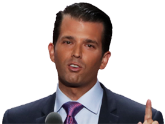
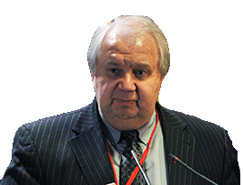

You hear about the investigations into President Trump and Russia every day. It is extremely complicated, and difficult to keep track of everything.

There is the criminal investigation being led by special counsel Robert Mueller on behalf of the Justice Department and the FBI. It has already led to criminal charges against people in Trump's inner circle and has resulted in five guilty pleas. Then there are two House investigations -- one led by the Intelligence Committee and one by the Oversight and Government Reform Committee. Finally, there are two Senate probes as well -- one by the Intelligence Committee and one being led by the Judiciary Committee.

All of the investigations are focused on the same central topics: What role Russian hackers played in the 2016 campaign, and whether the Trump campaign colluded with the Russian government. Most of the investigations are centered on the same players, but there are some tangentially connected characters whose ultimate significance may not yet be fully understood.

Here's a look at who's who at a glance, and how they're connected.

^^^^^^
## The Trump family

### Donald Trump
#### 45th U.S. President who won a surprise victory in 2016
The man at the center of it all. Evidence is consistently surfacing that Trump or people in his orbit may have had some kind of interaction with the Russian government during the campaign, but Trump has denied having any political or business ties. According to the Senate Intelligence Committee testimony of former FBI Director James Comey, Trump asked Comey to back off of the criminal investigation into campaign adviser turned National Security Adviser Michael Flynn's ties to Russia. He also reportedly ordered Director of National Intelligence Dan Coats and NSA Chief Mike Rogers to publicly say there was no wrongdoing on Trump's behalf, and told them to get Comey to lay off of Flynn. Mueller is also looking at whether Trump tried to obstruct justice by issuing a misleading statement about his son's clandestine meeting with Russians at Trump Tower during the campaign."

### Jared Kushner
#### Trump's son-in-law, who serves as one of his closest advisers
Kushner denied having any interactions with Russian officials during the campaign, but subsequently acknowledged having two meetings. Reuters reported in May that Kushner spoke with Kremlin officials last year about setting up a secret backchannel to communicate about diplomatic matters. Around the same time, Kushner met with the chief executive of a state-owned bank with ties to Putin, and it is not clear why. Kushner has reportedly become a focus of the criminal investigation into the Trump campaign, but he faces no charges or specific allegations. He also turned out to have yet another Russia interaction, in a secret meeting at Trump Tower (see Donald Trump Jr.). Kushner had his security clearance downgraded in February 2018 after working at the President's elbow for a year on an interim clearance. And his business dealings and loans received after entering the White House came under scrutiny. 

### Donald Trump Jr.
#### Trump's eldest son and a trustee of the Trump Organization
President Trump's oldest son has admitted to setting up a meeting between campaign officials and a Kremlin-connected Russian lawyer to get dirt on Hillary Clinton in June 2016. After initially claiming that no meeting was "set up," Trump Jr. released emails exchanged with Rob Goldstone (see below), a music promoter who offered a chance for intel on Clinton. Goldstone made clear that this was part of Russia's bid to help Donald Trump, and Trump Jr. replied, "if it's what you say I love it." Trump Jr. claims he was only expecting to get basic opposition research. He also alternatively claimed that the meeting was "primarily" about "a program about the adoption of Russian children," which "was not a campaign issue at that time" and said later the info from the Russian lawyer was not useful.

### Eric Trump
#### Trump's son who co-runs the Trump Organization
Golf writer James Dodson claimed in 2017 year that Eric in 2014 told him that Russia gives the family "all the funds we need" for their golf courses. Eric has denied this encounter happened. He runs the Trump Organization with Donald Trump Jr.

^^^^^^
## Trump associates

### Jay Sekulow
#### Trump's lawyer
He is a constitutional lawyer who runs a radio show that he often uses to defend the President and regularly attack the credibility of the FBI and the Mueller probe. Sekulow has argued several freedom of speech cases before the Supreme Court. He was born to a Jewish family in Brooklyn and grew up on Long Island. He later became an evangelical Christian and became lead counsel for the right-leaning Center for Law and Justice.

### Paul Manafort
#### The second of Trump's three campaign managers
Longtime GOP lobbyist and political insider and his business partner Rick Gates were indicted by  Mueller on charges of conspiracy and money laundering in court papers unsealed on Oct. 30, 2017 for allegedly moving tens of millions of dollars through secret foreign accounts. Manafort resigned from the Trump campaign in August 2016 after reports that he lobbied for Ukraine's pro-Russian government in return for big bucks. Manafort's foreign financial ties are now being investigated by the CIA, NSA, FBI, Director of National Intelligence and the Treasury Department. He joined Donald Trump Jr. and Jared Kushner at Trump Tower June 9 for a meeting expecting to get damaging information about Hillary Clinton. Mueller added an additional 18-count indictment against him in February 2018 as Gates flipped and accepted a plea deal.

### Rick Gates
#### A longtime business partner of Paul Manafort
Gates accepted a plea deal with Mueller's team in February 2018 admitting that he lied to investigators. He was indicted with Manafort by Mueller on charges of conspiracy and money laundering in court papers unsealed on Oct. 30. The pair were accused of laundering millions of dollars through offshore accounts. Gates' and Manafort's firm did work for high-profile Eastern European clients, including pro-Russian government officials in the Ukraine. He was Manafort's number two when he was the Trump campaign's chairman, and stayed on after his longtime business associate's departure. He worked on the Trump transition team and the President's inauguration committee, and helped launched the pro-Trump PAC "America First Policies" with five other former Trump campaign aides. He was pushed out in March after it was reported he was being probed by the Feds.

### California man working with Mueller
#### Pinedo pleaded guilty to identity fraud, having apparently played an unintentional role in the Russian effort by selling bank account numbers with stolen identities.

### George Papadopoulos
#### A former foreign policy adviser to the Trump campaign
Papadapoulos pleaded guilty to lying to the feds about his contacts with Russian officials in early October. The plea was unsealed on Oct. 30 -- the same day the Paul Manafort and Rick Gates indictments were unsealed. Papadopoulos joined the Trump campaign as a foreign policy adviser in March 2016. Before that he was based in London, and acted as an adviser for Ben Carson's previous Presidential bid, according to his LinkedIn page. He bills himself as an oil and gas expert, having previously worked at Energy Stream and the Director of the Centre for International Energy and Natural Resources Law & Security. He admitted to lying to the FBI about his meetings with a Russian professor with ties to the Russian government as well as a woman he thought was related to Vladimir Putin. He told the feds he'd been promised "dirt" on Hillary Clinton.

### Roger Stone
#### A gadfly Republican consultant who worked on Trump's campaign
The criminal probe is looking into his potential contacts with Russian operatives. Stone has admitted to secretly speaking with WikiLeaks founder Julian Assange and supposed hacker Guccifer 2.0 (see Foreign players, below), but he has denied any Russia ties or advanced knowledge of the cyberattacks on Clinton's campaign. The flamboyant former Trump adviser communicated directly with Wikileaks despite repeatedly saying otherwise -— including during testimony before the house Intelligence Committee. Mueller's team is reportedly honing in on whether Stone or Trump were aware of Wikileaks plans to publish troves of stolen Democrats emails during the 2016 campaign.

### Jeff Sessions
#### Former U.S. Senator and now Trump's Attorney General
Sessions recused himself from the federal Russia probe -— incurring the wrath of Trump, who has publicly berated his pick for top prosecutor several time since. Sessions stepped away from the probe after disclosing campaign contacts with then-Russian ambassador Sergey Kislyak, which in turn led to Mueller's appointment. Two Democratic senators have alleged that Sessions had even more campaign meetings with Kislyak that have still been kept secret. Trump said publicly he would not have picked Sessions for his post had he known he would recuse himself. The former Alabama senator, an early supporter of Trump's candidacy, has endured a year's worth of Twitter tirades and even had his resignation rebuffed by the mercurial commander-in-chief. Sessions incurred Trump's ire again in February 2018 by enlisting the Department of Justice inspector general to look into possible abuses by prosecutors and top FBI brass. Trump and Republicans believe DOJ and FBI officials erred in obtaining a warrant through the Foreign Intelligence Surveillance Act to monitor the communications of Trump campaign adviser Carter Page.

### Michael Flynn
#### retired Army general who resigned as national security adviser
The former Trump national security adviser pleaded guilty to lying to the FBI in December 2017. Mueller charged Flynn with "willfully and knowingly" making "false, fictitious and fraudulent statements" to the FBI regarding conversations with Russian Ambassador Sergey Kislyak. Flynn, who was already being probed for his connections to Turkish and Russian, officials resigned from the Trump administration after only 24 days on the job after reports that he'd misled Vice President Pence about his communication with Kislyak. He was the first former Trump administration official to be charged in relation to  Mueller's Russia investigation. Further complicating matters for the President, fired FBI director James Comey has claimed that Trump pressured him to let go of an investigation into Flynn. Mueller's team  postponed Flynn's sentencing in February 2018 due to the "status" of the investigation.

### Michael Cohen
#### Trump's personal lawyer is under investigation
Cohen has become a focus of the House and Senate investigations for unclear reasons. An unverified intelligence dossier about Trump (see Christopher Steele, below) alleged that Cohen met with Russian officials during the campaign, something Cohen has denied. Cohen has come under renewed scrutiny after his admission that he made a $130,000 payment weeks before the 2016 election to Stormy Daniels, a porn star who allegedly had a months-long affair with Trump in 2006.

### Boris Epshteyn
#### Russian-born Republican strategist
Epshteyn resigned from a White House communications job under Trump after only two months. He confirmed that he has been contacted for information for the House investigation, but little is known about his suspected campaign activities.

### Michael Caputo
#### A Trump campaign communications adviser
Caputo has been asked to provide documents and an interview for the House investigation. He has denied any campaign involvement with Russian officials. He worked in the 2000s for Gazprom Media, a pro-Putin Russian conglomerate, and met his second wife while working on a 2007 election in Kiev, Ukraine.

### Carter Page
#### A foreign policy adviser for Trump's campaign
The FBI obtained a court order to surveil Page's communications after suspicions that he interacted with Russian officials during the campaign. The oil industry consultant denied any contact but did not deny reports that he spoke with Kislyak during the Republican National Convention. Prosecutors say Russian spies tried to recruit him in an unrelated scheme in 2013. The Kremlin-connected undercover agents dubbed him an "idiot." Named as a foreign policy adviser to the Trump campaign in 2016, Page delivered a bizarrely pro-Russian speech in Moscow. He also met with top Kremlin officials during the trip, according to the dossier compiled by British spy Christopher Steele. Republicans and Trump have latched onto the surveillance as an example of overreach by the FBI and the Department of Justice. But Democrats point to Page's past as a cheerleader for Russian businesses and interests as more than enough evidence for observation.

### Rob Goldstone
#### Publicist and former British tabloid reporter
A music promoter who has known Trump for several years and connected him with his client Emin Agalarov, a Russian pop star. Goldstone emailed Donald Trump Jr. in June 2016 offering a chance to learn "incriminating" information about Hillary Clinton. He explictly said it was "part of Russia and its government's support for Mr. Trump." He and Trump Jr. exchanged emails for several days to arrange the meeting for June 9. 

^^^^^^
## Federal (and former) investigators

### Robert Mueller
#### Special Counsel leading the criminal investigation
After Comey's firing, Mueller -- a former FBI director -- has been assembling an all-star prosecution team with lawyers who worked on Watergate and the Enron collapse. Since May 2017, Mueller has issued over 100 criminal charges against 19 people and three Kremlin-linked companies. His work has led to five plea deals and he is reportedly assembling a case for criminal charges against Russians who carried out the hacking and leaking of Democrat emails and other information in order to influence the 2016 election.

### James Comey
#### Former FBI director who Trump abruptly fired in May
Comey was leading an investigation into Trump's campaign. Weeks before his sudden ouster, he revealed the investigation -- an unusual disclosure for an active inquiry. Comey kept memos of his nine conversations with Trump, which showed the President pressuring him to drop the investigation and to pledge his "loyalty." Comey leaked one of the memos to the New York Times through a friend who teaches at Columbia Law School. In a Senate testimony, Comey repeatedly accused Trump of lying about their interactions. His name has also come up in the Republicans' complaints about FISA warrants.

### Rod Rosenstein
#### The deputy attorney general and investigating Sessions' recusal
He appointed Mueller and also wrote a critical letter about Comey that was initially cited as a major reason for Trump firing him. Trump later said it was his decision alone to fire Comey. Trump has reportedly mulled firing Rosenstein and the GOP released a memo that included questions about his past. His name has also come up in Republicans' complaints about FISA warrants.

### Sally Yates
#### Former acting attorney general fired by Trump
She was fired only days into Trump's presidency. Yates testified before the Senate Judiciary Committee that she warned White House officials that Mike Flynn had lied to FBI agents about the subject of his conversation with Kislyak and that the Russians could potentially use that information to blackmail him. The White House did not take any action about her concerns until reports about Flynn became public weeks later. Yates' name also came up in the GOP-penned memo released in February 2018 that questioned requests for FISA warrants.

### Rep. Devin Nunes
#### (R-Calif.) Chairman of the House Intelligence Committee
Nunes initially recused himself from the House intelligence committee's investigation after allegations that he mishandled classified information in the case and had appeared to be coordinating the White House. He forced the release of a GOP-penned memo alleging political bias at the FBI. The misleading document also claimed that requests for surveillance of Carter Page were based on nothing other than the Steele dossier, which was not correct. He also reportedly leaked texts related to the Russia investigation evidence to Fox News that, when taken out of context, were briefly embarrassing to Sen. Mark Warner (D-Va.).

### Sen. Richard Burr
#### (R-N.C.) Chairman of the Senate Intelligence Committee
Burr supported and even advised Trump during the 2016 race. But he now leads one of the investigations into the Trump campaign. Burr has become increasingly critical of Trump's conduct, saying he was "troubled" especially by the firing of FBI Director James Comey.

### Sen. Charles Grassley
#### (R-Iowa) Chairman of the Senate Judiciary Committee
The leader of another investigation into the Trump campaign, who pushed James Comey to tell the public that President Trump was not personally under investigation.
^^^^^^
## Foreign players

### Vladimir Putin
#### The President of Russia, who is chummy with President Trump
The U.S. has accused Putin's government of leading the cyber attacks on Democrats during the 2016 campaign -- something that Putin has denied. The U.S. alleges Putin wanted to tip the scales for Trump to test Western alliances and prevent Hillary Clinton, who has feuded with Putin, from winning. Trump and Putin met at the G20 Summit in July, and the Russian strongman kept up his denials. Conflicting reports emerged on how hard Trump pressed Putin for answers, but the sitdown did not seem to change Trump's friendly attitude toward Putin.

### Emin Agalarov
#### Russian pop star who did business with President Trump
A client of Rob Goldstone. Agalarov met Trump in 2013 during the Miss Universe pageant in Moscow and featured him in a music video. When Trump returned to the United States, he tweeted to Agalarov's father, a billionaire Moscow developer, that he wanted to collaborate on "Trump Tower Moscow". The project never happened.

### Aras Agalarov
#### Father of pop star Emin Agalarov
Major Moscow developer with deep ties to the Kremlin who paid Trump to bring the Miss Universe pageant to Russia in 2013. Sometimes referred to as the "Trump of Russia" for his self-branding of buildings, Agalarov amassed most of his fortune through state-funded contracts. A publicist for the real estate oligarch's pop star son set up the notorious Trump Tower meeting with a Russian lawyer who allegedly had damning information about Hillary Clinton. 

### Natalia Veselnitskaya
#### Russian lawyer who organized the Trump Tower meeting
Russia lawyer who met with Trump Jr., Manafort and Kushner at Trump Tower in June 2016. She claims Trump Jr. promised to review a U.S. law targeting Russians if his father won the election and asked her for written evidence of wrongdoing by Clinton. The 42-year-old also claims she was acting independent of the Kremlin, but reports show that she discussed the information she sought to share with the Trump campaign with top Russian officials.

### Ike Kaveladze
#### Russian businessman who was at the Trump Tower meeting
Soviet-born U.S. businessman and senior vice president at Crocus Group, the real-estate development firm owned by oligarch Aras Agalarov. His attorney says he was asked by Agalarov to attend the June 2016 Trump Tower meeting as a translator. He has been linked to a decades-long scheme to launder more than $1.4 billion from Russians and other Eastern Europeans through U.S. banks.

### Yevgeny Prigozhin
#### Putin's Chef
A restauranteur who ran Putin's favorite waterside dining spot, the 56-year-old is an ex-con who runs several companies with Kremlin contracts. Mueller's indictment alleges he funded the Internet Research Agency, a "troll factory" that used social media and other avenues to "sow discord in the U.S. political system." He also reportedly runs mercenary troops who attacked U.S. troops in Syria."

### Alex Van Der Zwaan
#### Attorney who worked for Ukraine and is the son-in-law of a Russian oligarch
Van der Zwaan is a Dutch lawyer who pleaded guilty in February 2018 to lying to Mueller's team about his discussions with Gates and another unnamed person. He worked for the international lawfirm Skadden Arps, which produced a report for the Ukrainian government in 2012. The 33-year-old's father-in-law is German Khan, a Ukrainian-Russian who is a part owner of Russia's Alfa Bank and is mentioned in the Steele dossier.

### Nigel Farage
#### A leader of the U.K. Brexit movement
Farage has been named as "person of interest" in the criminal investigation. He is a strong ally of Trump's and also has nebulous associations with Russia's RT news network and with WikiLeaks founder Julian Assange. Farage has denied any connection to alleged wrongdoing.

### Julian Assange
#### The founder of WikiLeaks, a "not-for-profit media organization"
WikiLeaks published stolen emails from the Democratic National Committee and from Clinton's campaign in the final stretch of the 2016 race. The Obama administration alleged that Russia was the source of the hacked emails and used WikiLeaks as an intermediary for publishing them, but Assange has repeatedly denied this. Assange met with Nigel Farage in March and there have been no details released about their discussion.

### Guccifer 2.0
#### Took credit for the breach of the Democrat emails
This supposed hacker has not been officially identified and the U.S. intelligence community believes this is a false persona created to deflect attention from Russia for the hacks.

### Sergey Kislyak
#### Recently recalled Russian Ambassador to the United States
Kislyak keeps getting Trump people in trouble just by talking to them. Michael Flynn resigned after talking to him. Jeff Sessions recused himself from the criminal probe for talking to him. And Kislyak was with Russian Foreign Minister Sergey Lavrov at the White House when Trump revealed highly classified information from an Israeli intelligence source the day after Comey's firing. The Kremlin decided in June to recall Kislyak back to Moscow, even though he was expected to start working with the United Nations in New York.

### Sergey Lavrov
#### Longtime diplomat and the current Russian Foreign Minister
Lavrov joined Ambassador Sergey Kislyak for a White House meeting in May, in which President Trump exposed highly classified information about ISIS threats.

### Christopher Steele
#### A British intelligence officer, formerly with MI6
Steele compiled an infamous dossier about Trump's supposed history with Russia. The dossier, which Buzzfeed News published in January, alleges that Russia has been grooming and blackmailing Trump behind the scenes for years as part of a conspiracy to shatter Western relations. Trump denied the allegations and the dossier's main thesis remains unverified. But since its publication, several secondary allegations about Russian officials and the Kremlin cyberattack campaign have been validated by further reports.
